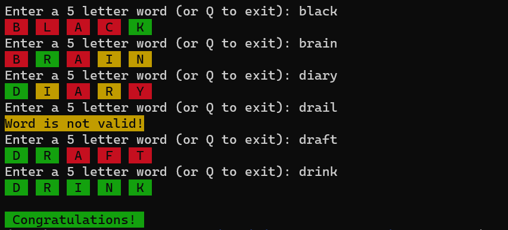

# Wordle Game



## How to Run
- First, you need to install the dependencies. You can do this by running the following command:
```
pip install -r requirements.txt
```
- Then, you have to add the current directory to your `PYTHONPATH`
run `export PYTHONPATH=$(pwd)`
- Then, you can run the game by running the following command:
```
python src/run.py
```